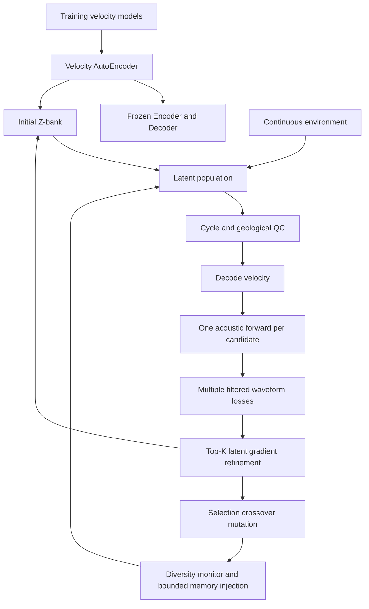

# Environment-Adaptive Genetic–Gradient FWI

面向科研原型的 PyTorch 2D acoustic full waveform inversion：速度模型 AE、latent GA、连续动态环境、Top-K latent-gradient refinement、Z-bank 和廉价 QC。代码 MIT；随附 OpenFWI 数据单独采用 **CC BY-NC-SA 4.0**。

## 研究问题与边界

传统 FWI 对初始模型敏感，存在 cycle skipping 和局部极小值；直接在高维速度网格运行 GA 又需要大量 PDE 求解。本项目将速度模型压缩到低维 latent manifold，使用 GA 发现有潜力的搜索盆地，再用可微 Decoder 和声学梯度局部收敛。连续环境逐步从低频、较大种群和较强变异，过渡到高频、较小种群和更多局部优化。

**latent search 不会自动降低一次 PDE solve 的成本。** 希望减少的是无效候选、种群数量和总 PDE evaluation 次数，需要通过消融验证，不能由 smoke test 推断性能提升。

Encoder 的输入始终是 **velocity model**，不是 observed seismic。Z-bank 是有容量上限的历史记忆库；它保存环境信息并在多样性坍缩时按质量、latent 差异和环境距离选择预算内的注入样本。



## 安装

Python 3.10+。CPU smoke 可运行；要使用 CUDA，请先按 [PyTorch 官方安装指南](https://pytorch.org/get-started/locally/)安装适合硬件的版本。

```powershell
# Windows：依赖、缓存和实验优先放 E 盘
$env:FWI_HOME = 'E:\Codex\environment-adaptive-genetic-gradient-fwi'
python -m venv "$env:FWI_HOME\.venv"
& "$env:FWI_HOME\.venv\Scripts\Activate.ps1"
python -m pip install torch --index-url https://download.pytorch.org/whl/cpu
python -m pip install -e ".[test]"
```

```bash
# Linux/macOS 或其他磁盘
python -m venv .venv
source .venv/bin/activate
python -m pip install -e '.[test]'
export FWI_HOME=/path/to/fwi-data
```

未设置 `FWI_HOME` 时，Windows 检测到已有 `E:/Codex/environment-adaptive-genetic-gradient-fwi` 目录会使用它；其他机器使用仓库根目录。源码与随附小样本留在仓库内，checkpoint 和运行输出由存储根目录管理。E 盘用于磁盘存储，不会增加 RAM 或 GPU 显存。

## 数据

已经包含真实 OpenFWI FlatVel-A 速度模型：64 个训练样本 + 8 个来自官方留出分片的 smoke 验证样本，均为 `(1,70,70)`、`float32`、m/s。完整两个分片共约 19.6 MB。

```bash
python scripts/download_data.py
python scripts/download_data.py --full-shards
```

来源、版本、SHA256、许可、拆分约定与更大训练集建议见 [docs/DATASETS.md](docs/DATASETS.md)。下载传输采用固定版本的非官方镜像，并明确记录其身份和校验范围。未把几十 GB 波形上传普通 Git；AE 本身只需要速度模型。

## 从训练到反演

在仓库根目录运行：

```bash
# 1. 小型合成训练集，无网络依赖
python scripts/train_ae.py --config configs/ae.yaml

# 或使用随附真实速度模型（独立 checkpoint 目录）
python scripts/train_ae.py --config configs/ae_openfwi.yaml

# 2. 只用 AE 训练集初始化记忆库
python scripts/build_zbank.py

# 3. 快速闭环（3代）或默认基础实验（30代）
python scripts/run_inversion.py --config configs/smoke.yaml
python scripts/run_inversion.py --config configs/inversion.yaml

# 真实 OpenFWI 留出模型：重新生成匹配本项目声学算子的观测
python scripts/build_zbank.py --checkpoint checkpoints/openfwi/autoencoder.pt --output checkpoints/openfwi/zbank.pt
python scripts/run_inversion.py --config configs/inversion_openfwi.yaml

# 4. baseline、完整消融和评估
python scripts/run_baseline_fwi.py --config configs/smoke.yaml
python scripts/run_ablation.py --config configs/experiment.yaml
python scripts/evaluate.py --run outputs/smoke

# 5. 回归测试
pytest
```

反演可在代边界中断并精确续跑，原始 `generations` 保持不变：

```bash
python scripts/run_inversion.py --config configs/inversion.yaml --max-additional-generations 5
python scripts/run_inversion.py --config configs/inversion.yaml --resume outputs/inversion/inversion.pt
python scripts/train_ae.py --config configs/ae.yaml --resume checkpoints/autoencoder.pt
```

AE 续训前将 YAML 的 `training.epochs` 增大到新的总轮数。基线也支持 `--resume` 与 `--max-additional-generations`。Z-bank 带有 AE 权重指纹，更换 checkpoint 后必须重新构建。

`run_ablation.py` 默认运行 3 个种子 × 8 个变体；也支持 `--seeds 43 --variants full no_bank --no-plots`。各次使用相同种子的观测和相同初始速度。默认运行按代数配置，**并非等 PDE 预算**；比较时需同时查看误差和实际求解次数。

| 变体 | 连续环境 | 局部 latent FWI | Z-bank | QC |
| --- | --- | --- | --- | --- |
| gradient | 是 | 直接优化速度网格 | 否 | 速度边界 |
| latent_ga（B） | 否，固定终态 | 否 | 否 | 是 |
| ga_local（C）/no_bank | 是 | 是 | 否 | 是 |
| ga_bank_static（D） | 否，固定终态 | 否 | 是 | 是 |
| full | 是 | 是 | 是 | 是 |
| no_local | 是 | 否 | 是 | 是 |
| no_dynamic | 否，固定终态 | 是 | 是 | 是 |
| no_qc | 是 | 是 | 是 | 否 |

`no_qc` 关闭廉价拒绝，不自动移除 cycle/geological 正则；它们的权重可在环境 YAML 中分别设为零。`center_frequency` 通过共同的平滑低通限制观测/合成频谱，截止频率为其两倍；不改变观测源子波。整数预算经连续插值后取整，其余参数保持连续。

输出含 `summary.json`、每代 `history.jsonl`、完整可恢复 checkpoint、真实/初始/恢复速度、绝对误差图、目标函数与多样性/频带/种群/PDE曲线。`decoded_velocity.npy` 保存原始 Decoder 输出；若最终平滑尺度非零，`recovered_velocity.npy` 是用于最终参考正演的平滑版本。

合成观测与 AE 训练样本使用不同随机种子。默认实验是闭环检查，不是发表级地质反演质量。外部观测必须匹配源子波、网格、时间采样和采集几何；本项目简化求解器生成的波形不等同于 OpenFWI 发布波形。

## 配置与可扩展性

`configs/ae.yaml` 控制维度、模型范围、训练和数据；`configs/environment.yaml` 控制全部连续 schedule；`configs/inversion.yaml` 控制物理、GA、QC、局部优化、记忆预算和停止条件；`configs/experiment.yaml` 控制重复种子及消融。`configs/smoke.yaml` 用深合并继承默认配置。

模块边界：`src/data` / `models` 负责离线阶段，`physics` 负责正演与滤波，`ga` / `environment` / `zbank` / `qc` 负责搜索控制，`fwi` 负责局部梯度，`inversion` 负责连接和状态管理，`utils` 负责复现与报告。

## 数值与解释限制

- 第一版为 2D constant-density acoustic 有限差分，简化吸收边界用于小型实验；不代表工业级 PML、弹性、三维或实测资料处理。
- 一个候选只正演一次，再对同一波形进行多个频段的滤波。梯度优化的每次目标求值均计入 PDE 预算。
- Cycle QC 是可配置的启发式指标，不能保证地质正确性；可单独禁用，也应检查拒绝率和筛选偏差。
- 环境变化意味着不同代的原始 fitness 不可直接比较。报告另提供固定终态环境的参考损失，用于跨代改进判断。
- Z-bank 同时保存当时环境分数与固定参考分数，跨代质量排序只用后者；离线 seed 的质量标为未知，只用于初始化，不能作为“历史优良”个体注入。注入后的候选在当前环境重新评估。
- 默认对所有通过 QC 的候选计算固定终态参考目标，额外 PDE 全部计数。可以显式设置 `reference_top_k` 限制该开销，但此时 best 和停止判断仅覆盖被监测的候选子集。
- 注入日志区分放入下一代、通过 QC/物理评估、以及局部优化后优于该代非注入最优这三个数量；短实验中成功注入为零是正常实测结果。
- AE 的低维表示可能排除真实地质模型；Marmousi2 等分布外验证必须单独报告。
- 默认 CUDA 自动选择只是设备支持；本次交付实际运行证据见验证记录，未测试硬件不得宣称验证通过。

详细运行证据将在 [docs/VALIDATION.md](docs/VALIDATION.md) 中列出。
